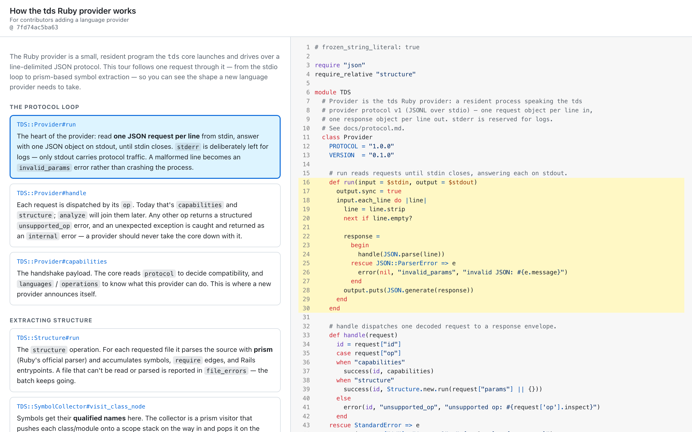
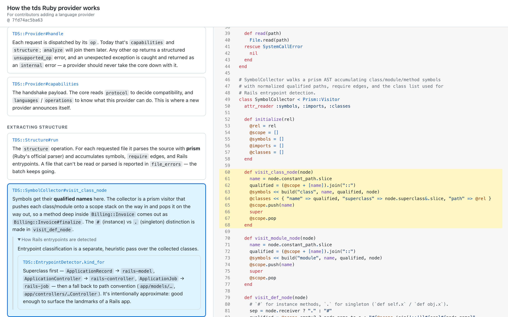
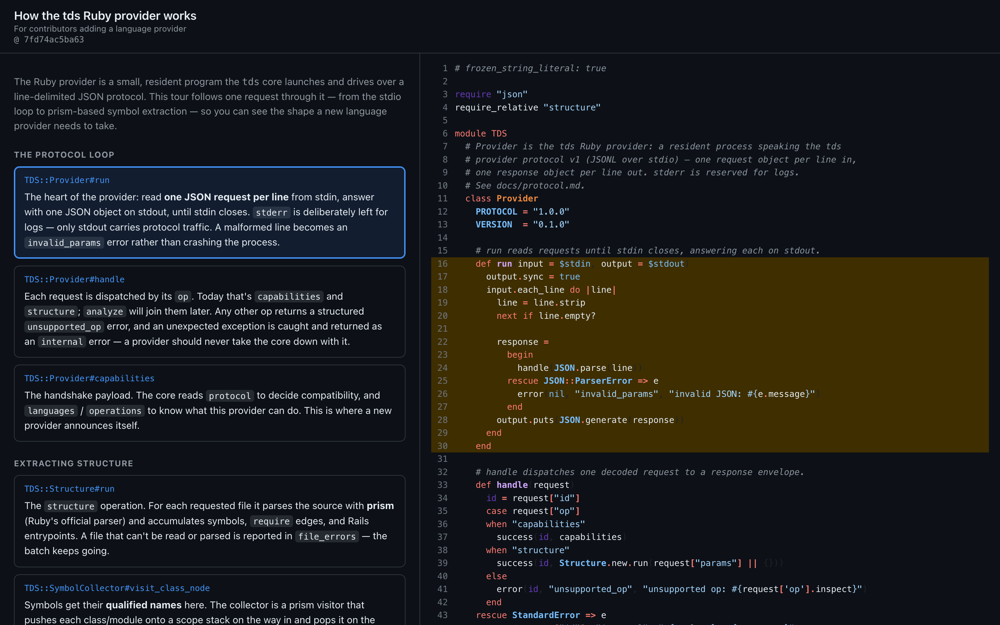

# tour-de-source (`tds`)

**Analyze a repository and produce a shareable, interactive _tour_ of the codebase** —
for onboarding, demos, code review, and interviews. A tour is guided narration
anchored to real code, compiled into a self-contained static site you can open in
a browser or email to someone. It's shareable both as **content** (diffable
Markdown) and as an **experience** (the viewer below).



> The screenshots on this page are a **real tour of this repository's Ruby
> provider**, produced by `tds map` + `tds build`. The tour source is
> [`docs/tours/ruby-provider.tour.md`](docs/tours/ruby-provider.tour.md).

## How it works

A tour walks the reader through code in a deliberate order. The left rail is the
narration — chapters and stops; the right pane shows the actual source, and each
stop drives the code pane to its **anchor** (a symbol like
`app/models/invoice.rb::Invoice#finalize`, resolved to a concrete line range).
Stops can carry collapsible **side-quests** for role-specific detours.

| Side-quests (detours) | Dark theme |
|---|---|
|  |  |

The bundle is **pinned to a commit** and fully self-contained — no server, no
network, no external assets — so a shared tour is always internally consistent
and works offline.

## Quickstart

```sh
# 1. Build the structural map of a repository (symbols, imports, git signals)
tds map .

# 2. Generate a tour skeleton from the map, then curate the prose
tds draft .
$EDITOR .tds/myproject.tour.md

# 3. Compile to a self-contained bundle and open it
tds build .tds/myproject.tour.md
open .tds/tour/index.html
```

`tds draft` does the structural work — it ranks your entrypoints, landmarks and
git hotspots, pours them into the onboarding template, and emits a `.tour.md`
whose anchors all resolve. What it leaves you is the prose: every stop carries a
`TODO` and the evidence tds used to pick it, so curating means fixing and pruning
rather than starting from a blank page.

### Let an assistant write the first draft of the prose

```sh
tds draft . --narrate
```

`--narrate` hands the finished skeleton to Claude Code — running in a tmux pane
on **your own subscription**, no API key — along with the source each stop
anchors, and asks only for prose. On Redmine that fills all 18 stops in a single
request.

The division of labour is the point. **tds decides what to point at; the model
only writes about it.** Anchors are chosen from the map before the assistant is
involved and are never part of its response, so it cannot point a stop at a
symbol that does not exist. Prose that tries to smuggle in a tour directive is
rejected and the stop keeps its `TODO`.

Narrated prose is a *first draft*, not a finished tour — the model can write
something fluent and wrong. The generated file says so at the top. Read it before
you share it.

A tour source file is Markdown with light directives:

```markdown
---
title: "A tour of the billing service"
audience: "new backend engineers"
---

# Chapter: Follow one invoice end to end

::stop{anchor="app/models/invoice.rb::Invoice#finalize" focus="def finalize"}
`finalize` is the whole domain in a few lines — get an invoice from draft to
finalized without double-charging.

::detour{title="If you're debugging a stuck invoice"}
Stuck invoices are almost always the lock below.
::stop{anchor="app/models/invoice.rb::Invoice#with_lock"}
...
::
::
::
```

Anchors are **symbol-first** with a `path:line-start-end` fallback; they resolve
against the map, so ordinary edits (code shifting around) don't break them —
only genuine renames/deletes do, and `tds check` (coming) reports that drift.

## Touring a repository you don't own

By default every stage writes into `<repo>/.tds/`. That's convenient for your own
project, but it dirties a checkout you may not want to touch. Every stage takes
an explicit output path, so keep the whole tour **out of tree** and leave the
subject repository untouched:

```sh
REPO=~/src/redmine                 # the repository being toured
WORK=~/tours/redmine               # everything tds produces lives here
mkdir -p "$WORK"

# 1. Map -> $WORK/map/{map.sqlite,map.json}
tds map "$REPO" --out "$WORK/map"

# 2. Draft -> $WORK/redmine.tour.md
tds draft "$REPO" --map-dir "$WORK/map" --out "$WORK/redmine.tour.md"

# 3. Curate the prose (this is the part only a human can do)
$EDITOR "$WORK/redmine.tour.md"

# 4. Build -> $WORK/site/index.html
tds build "$WORK/redmine.tour.md" \
    --repo "$REPO" \
    --map  "$WORK/map/map.sqlite" \
    --out  "$WORK/site"

open "$WORK/site/index.html"
```

This leaves a self-describing layout, and `git status` in `$REPO` stays clean:

```
~/tours/redmine/
├── map/
│   ├── map.sqlite          # the structural index
│   └── map.json            # same data, diffable
├── redmine.tour.md         # the tour source — the thing you edit and version
└── site/
    ├── index.html          # the shareable tour (open this)
    ├── manifest.json       # compiled tour + resolved anchors
    └── repo/               # the pinned source snapshot the viewer reads
```

The `.tour.md` is the artifact worth keeping in version control — it's the
curation. The map and the bundle are both reproducible from it plus the repo at
the pinned commit.

**Scale.** Redmine (2,264 files, ~1,100 Ruby) maps in under two seconds and
yields ~13k symbols. The built bundle embeds the whole repo at the pinned commit,
so it runs to tens of MB — that's the cost of a tour that works offline with no
server.

## Pipeline

`tds` is a small Go binary that orchestrates discrete, inspectable stages.
Deep language analysis lives in out-of-process **providers** behind a
[versioned JSON protocol](docs/protocol.md), so the core stays language-neutral
and ships as one static binary.

| Stage | What it does | Status |
|---|---|---|
| `tds map` | Structural index: symbols, imports, Rails entrypoints, git signals → SQLite + JSON | ✅ working |
| `tds analyze` | Run language tooling (linters, types, coverage) into normalized findings | 🚧 pipeline built, no command yet (M3) |
| `tds draft` | Generate a curated-ready tour skeleton from the map, optionally narrated by an assistant (`--narrate`) | ✅ working |
| `tds build` | Compile a tour into a self-contained static bundle | ✅ working |
| `tds check` | Re-resolve anchors against HEAD and report drift | 🚧 planned |

**Languages:** Ruby/Rails today (via a prism-based provider); JavaScript/React
next. A tree-sitter fallback covers other languages with line-range anchors.

## Status

Early, but the core loop works end to end: **`tds map` → `tds draft` → curate →
`tds build` → open a real, shareable tour.**

Drafting splits the work along the line where machines and judgment actually
differ. **Choosing what to point at is deterministic** — ranked from the map's
entrypoints, git signals and symbol sizes — so every anchor names a symbol that
provably exists. **Writing about it is optional and delegated**: `--narrate`
hands that skeleton to an assistant, which never sees a chance to change an
anchor because anchors are not part of its response.

That leaves the honest gap where it belongs. tds can tell you `Issue` is the
landmark; whether the paragraph about it is *true* still needs a human read, and
the generated file says so.

See [`docs/design.md`](docs/design.md) for the full design,
[`docs/implementation-plan.md`](docs/implementation-plan.md) for the roadmap, and
[`docs/tmux-orchestration.md`](docs/tmux-orchestration.md) for how `--narrate`
drives the assistant.

## Build from source

Requires **Go 1.26+**. The Ruby provider requires **Ruby 3.4+** (prism ships as a
default gem).

```sh
make build        # -> ./bin/tds
make check        # lint + tests
```

The Ruby provider isn't published globally yet, so point `tds` at the in-repo
build when mapping Ruby code:

```sh
export TDS_PROVIDER_RUBY="$PWD/providers/ruby/exe/tds-provider-ruby"
./bin/tds map .
./bin/tds build docs/tours/ruby-provider.tour.md
```

## Documentation

- [`docs/design.md`](docs/design.md) — architecture and design decisions
- [`docs/implementation-plan.md`](docs/implementation-plan.md) — milestones and tasks
- [`docs/protocol.md`](docs/protocol.md) — the provider protocol (v1)
- [`docs/tmux-orchestration.md`](docs/tmux-orchestration.md) — driving an assistant over tmux
- [`docs/tours/ruby-provider.tour.md`](docs/tours/ruby-provider.tour.md) — an example tour
