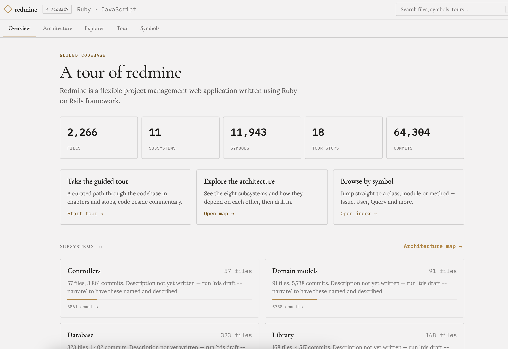
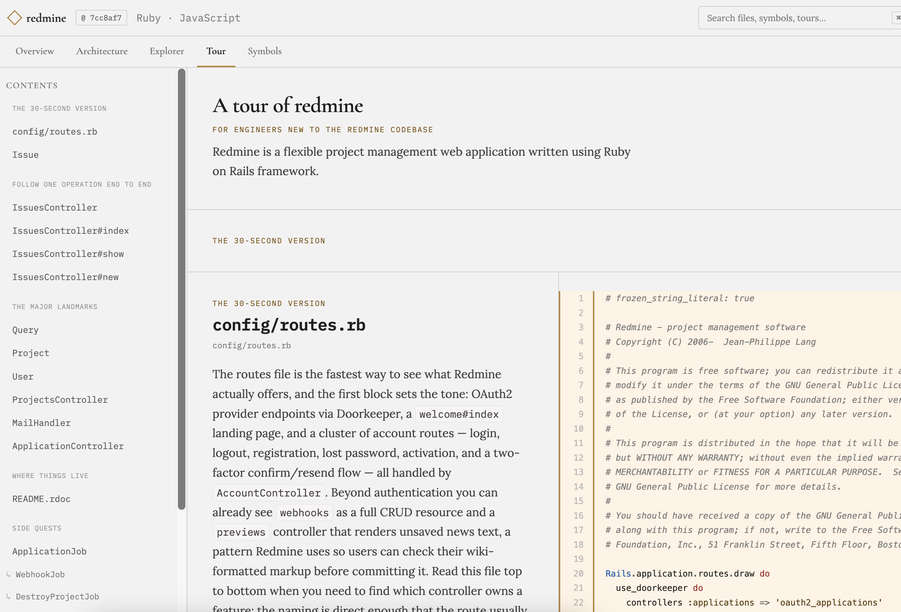
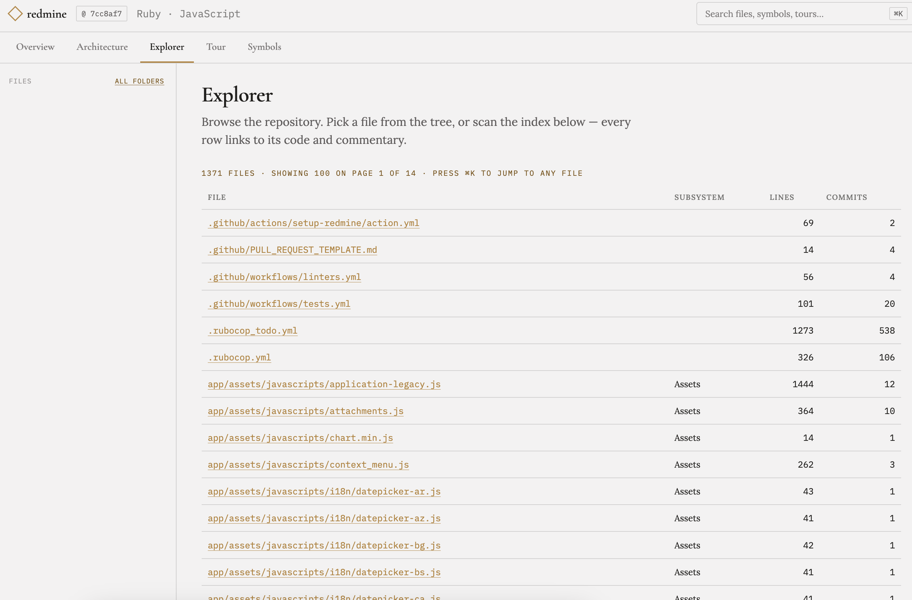
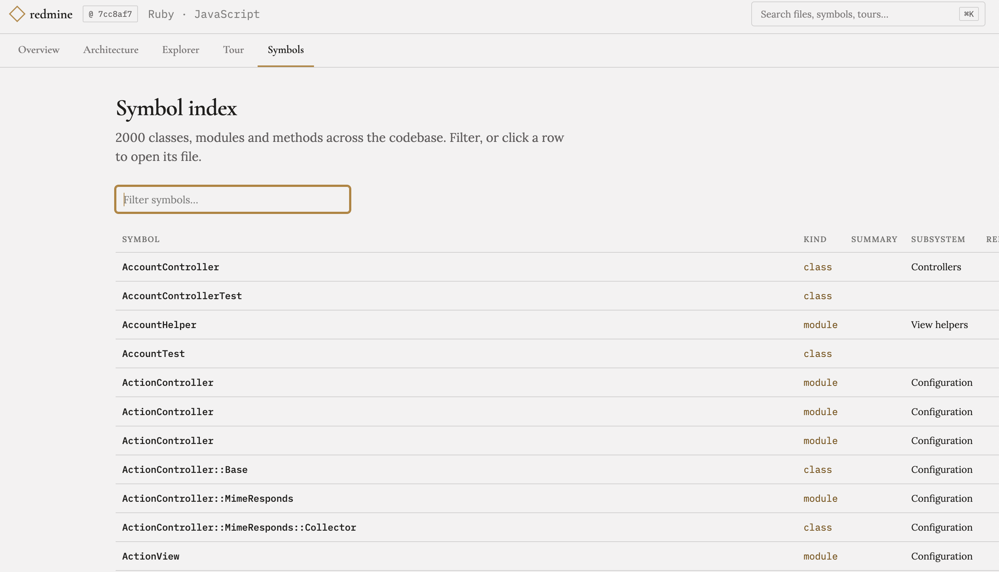
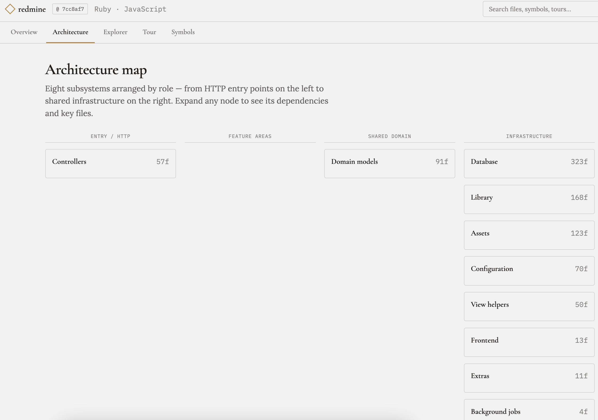

# tour-de-source (`tds`)

**Analyze a repository and produce a shareable, interactive _tour_ of the codebase** —
for onboarding, demos, code review, and interviews. A tour is guided narration
anchored to real code, compiled into a browsable static site. It's shareable both
as **content** (diffable Markdown) and as an **experience** (the site below).



> Every screenshot on this page is a **real tour of
> [Redmine](https://github.com/redmine/redmine)** — 2,264 files, 11,943 symbols —
> produced by `tds map` + `tds draft --narrate` + `tds build`, unedited.

## What you get

`tds build` renders a browsable site over one pinned commit — tour, explorer,
symbol index, architecture map, and (when you run `tds analyze`) findings.

### The tour

The reason the thing exists. Narration walks the reader through code in a
deliberate order: prose on the left, the actual source on the right, each stop
resolved to a concrete line range from its **anchor** (a symbol like
`app/models/invoice.rb::Invoice#finalize`). Stops can carry collapsible
**side-quests** — the `↳` entries under *Side quests* in the outline.



### Explorer and symbol index

Free browsing over the whole repository, not just the files the tour visits:
a page per source file with its commentary, imports and importers, plus a
filterable index of every class, module and method. `⌘K` searches files, symbols
and tour stops together.

| Explorer | Symbol index |
|---|---|
|  |  |

### Architecture map

Subsystems derived from the map, arranged by role, with dependencies lifted from
file-level import edges.



Grouping and every number here are measured, but the naming pass is not built
yet, so subsystem descriptions still say what was counted rather than what the
subsystem is for, and the role columns fill unevenly (see TDS-59, TDS-67).
Inventing a subsystem's purpose is exactly the confident-but-wrong text the rest
of the pipeline works to avoid, so it stays blank until it can be derived.

### Findings — your linters, layered over the tour

Optional, and the reason `tds analyze` exists. Run it and the site gains a
**Findings** tab plus three ways of seeing the same data in context:

- **Inline** — a severity-coloured dot in the gutter of every flagged line on a
  file page, with the rule and message on hover.
- **On the tour** — a stop shows what the analyzers flagged *inside the lines it
  is showing*, as a collapsed chip below the prose.
- **In the Explorer** — a complexity bar per file, so the risky files stand out
  while you browse.

Each view carries its **provenance** — `brakeman 8.0.4 · @ 7cc8af70` — because a
finding without the tool, its version and the commit is an anonymous accusation.
The panels filter by file, rule and severity; the heatmap ranks files by their
worst measurement.

Nothing here is presented as a verdict. The page says outright that this is tool
output, that a finding can be a false positive or a deliberate choice, and that
none of it has been reviewed by the tour's author.

On Redmine that is **1,504 findings** from rubocop, brakeman and flog — of which
the eight brakeman *errors* are the part worth a newcomer's attention, which is
exactly what the ranking surfaces.

The site is **pinned to a commit** and carries its own copy of the source, so a
shared tour is always internally consistent — it cannot drift from the code it
describes.

## Install

```sh
git clone https://github.com/charlesharris/tourdesource
cd tourdesource
make install
```

`make install` checks the toolchain, builds `tds` onto your `PATH` (wherever
`go install` puts binaries), and wires the Ruby provider so it is discovered
automatically — no environment variables to set. Re-run it after pulling, or
after moving the clone.

Then head to the [Quickstart](#quickstart-tour-your-own-project).

### Prerequisites

`make install` verifies these and tells you what is missing:

| Tool | Version | For |
|---|---|---|
| **Go** | 1.25+ | building the core |
| **Hugo** | extended 0.128+ | `tds build` (site rendering) — `brew install hugo` |
| **Ruby** | 3.4+ | the Ruby/Rails provider (prism ships as a default gem) — optional; other languages degrade to line-range anchors |
| **tmux** | any | `tds draft --narrate` only — the assistant is driven in a tmux pane |
| **Claude Code** | any | `tds draft --narrate` only — runs on your subscription, no API key |

Only `--narrate` needs the last two. Drafting without them still produces the
full tour skeleton, with `TODO` prose for you to write.

The **analyzers** (`tds analyze`) are the repo's own tools — `rubocop`,
`brakeman`, `flog`, `simplecov`, `sorbet`. Each is availability-gated: whatever
is installed runs, the rest are reported as skipped rather than failing.

Working on tds itself:

```sh
make build        # -> ./bin/tds, no install
make check        # lint + tests
```

## Quickstart: tour your own project

After [installing](#install), point `tds` at any repository. It works from
inside the project or from anywhere via an explicit path.

```sh
cd ~/src/my-project

tds map .                        # structural index: symbols, imports, git signals
tds analyze .                    # optional: run your linters into findings
tds draft . --narrate            # AI writes the first-draft prose (your subscription)
$EDITOR .tds/my-project.tour.md  # curate — the part only a human can do
tds build .tds/my-project.tour.md
```

Then **serve it** (see below) and open <http://localhost:8000>.

Each stage is independent and re-runnable. Skip `analyze` and you get the tour
without the findings layer; skip `--narrate` and every stop carries a `TODO`
plus the evidence tds used to pick it, so you are editing rather than starting
from a blank page.

`--narrate` needs **tmux** and **Claude Code** on your `PATH`; see
[Drafting and narration](#drafting-and-narration) for the full loop, including
how to keep the assistant's responses so a draft can be replayed for free.

Touring a repo you don't own, without dirtying its checkout? See
[Touring a repository you don't own](#touring-a-repository-you-dont-own).

### Serve the site

The output is a directory of static files. Any static server works:

```sh
cd .tds/site && python3 -m http.server 8000     # then http://localhost:8000

# or, if you prefer:
npx serve .tds/site
ruby -run -e httpd .tds/site -p 8000
```

**The site has to be served — opening it from disk does not work.** Pages link
to each other by directory (`./architecture/`), and over `file://` a browser
shows a directory listing instead of the page, so navigation breaks on the first
click. ⌘K search and the file tree fail too, because `fetch` is blocked on
`file://`. This is a hosted artifact, not an emailable file.

To publish, copy `.tds/site/` anywhere that serves static files — GitHub Pages,
S3, Netlify, an nginx directory. URLs are relative, so it works from a subpath.

### Iterating on the theme

`--keep-project` leaves the generated Hugo project in place so you can run
`hugo server` against real data:

```sh
tds build .tds/my-project.tour.md --project-dir /tmp/tds-site --keep-project
cd /tmp/tds-site && hugo server
```

## Drafting and narration

`tds draft` does the structural work — it ranks your entrypoints, landmarks and
git hotspots, pours them into the onboarding template, and emits a `.tour.md`
whose anchors all resolve. What it leaves you is the prose: every stop carries a
`TODO` and the evidence tds used to pick it, so curating means fixing and pruning
rather than starting from a blank page.

### Let an assistant write the first draft of the prose

The whole narration loop, start to finish:

```sh
cd ~/src/my-project

tds map .                                   # 1. structural index (required first)

tds draft . --narrate \
    --narrate-workdir .tds/narrate          # 2. assistant writes the prose

$EDITOR .tds/my-project.tour.md             # 3. read it — this is a first draft
tds build .tds/my-project.tour.md           # 4. compile the site
cd .tds/site && python3 -m http.server 8000 # 5. open http://localhost:8000
```

`--narrate` hands the finished skeleton to Claude Code — running in a tmux pane
on **your own subscription**, no API key — along with the source each stop
anchors, and asks only for prose. On Redmine that fills all 19 stops in two
requests, in about a minute.

Useful flags:

| Flag | Why |
|---|---|
| `--narrate-workdir <dir>` | Keep the prompts and raw responses. **Without it they are written to a temp dir and deleted when the run ends**, so replay is impossible after the fact. |
| `--narrate-timeout 20m` | Raise the per-request budget on a large repo (default 10m). |
| `--landmarks 10` | Propose more landmark stops (default 6). |
| `--audience "new backend engineers"` | Recorded in the frontmatter and given to the assistant as context. |

If narration produces nothing, the command **exits non-zero** and says how many
stops still carry `TODO`. The skeleton is still written, so nothing is lost —
but a failed narration never looks like a successful draft.

The division of labour is the point. **tds decides what to point at; the model
only writes about it.** Anchors are chosen from the map before the assistant is
involved and are never part of its response, so it cannot point a stop at a
symbol that does not exist. Prose that tries to smuggle in a tour directive is
rejected and the stop keeps its `TODO`.

Narrated prose is a *first draft*, not a finished tour — the model can write
something fluent and wrong. The generated file says so at the top. Read it before
you share it.

### Reproduce a narrated draft without re-spending tokens

Stop ids are derived from anchors, so a saved response can be replayed against a
regenerated skeleton. This needs the responses to still exist — which is why the
run above passes `--narrate-workdir`:

```sh
tds draft . --narrate --narrate-workdir .tds/narrate   # keeps the responses
ls .tds/narrate/                                       # narrate-1-001-out.json, ...

# Later — no tmux, no assistant, no tokens:
tds draft . --narrate-from .tds/narrate/narrate-1-001-out.json
```

Useful for regenerating after you tweak the template, and for recovering a draft
you overwrote. The saved response goes through the same validation gate as a
live one, so a stale or hand-edited file cannot smuggle anything in.

> Pass `--narrate-workdir` on any run you might want to replay. The default work
> directory is temporary and is removed when the run finishes.

### The tour source format

A tour source file is Markdown with light directives — this is what `tds draft`
emits and what you edit:

```markdown
---
title: "A tour of the billing service"
audience: "new backend engineers"
---

# Chapter: Follow one invoice end to end

::stop{anchor="app/models/invoice.rb::Invoice#finalize" focus="def finalize"}
`finalize` is the whole domain in a few lines — get an invoice from draft to
finalized without double-charging.

::detour{title="If you're debugging a stuck invoice"}
Stuck invoices are almost always the lock below.
::stop{anchor="app/models/invoice.rb::Invoice#with_lock"}
...
::
::
::
```

Anchors are **symbol-first** with a `path:line-start-end` fallback; they resolve
against the map, so ordinary edits (code shifting around) don't break them —
only genuine renames/deletes do, and `tds check` (coming) reports that drift.

## Touring a repository you don't own

By default every stage writes into `<repo>/.tds/`. That's convenient for your own
project, but it dirties a checkout you may not want to touch. Every stage takes
an explicit output path, so keep the whole tour **out of tree** and leave the
subject repository untouched:

```sh
REPO=~/src/redmine                 # the repository being toured
WORK=~/tours/redmine               # everything tds produces lives here
mkdir -p "$WORK"

# 1. Map -> $WORK/map/{map.sqlite,map.json}
tds map "$REPO" --out "$WORK/map"

# 2. Draft -> $WORK/redmine.tour.md
#    Add --narrate (plus --narrate-workdir, kept in $WORK) to have the
#    assistant write the prose instead of leaving TODOs.
tds draft "$REPO" \
    --map-dir "$WORK/map" \
    --out     "$WORK/redmine.tour.md"

# 3. Curate the prose (this is the part only a human can do)
$EDITOR "$WORK/redmine.tour.md"

# 4. Build -> $WORK/site/
tds build "$WORK/redmine.tour.md" \
    --repo "$REPO" \
    --map  "$WORK/map/map.sqlite" \
    --out  "$WORK/site"

cd "$WORK/site" && python3 -m http.server 8000
```

This leaves a self-describing layout, and `git status` in `$REPO` stays clean:

```
~/tours/redmine/
├── map/
│   ├── map.sqlite          # the structural index
│   └── map.json            # same data, diffable
├── redmine.tour.md         # the tour source — the thing you edit and version
└── site/
    ├── index.html          # the overview — start here
    ├── index.json          # search index behind ⌘K
    ├── tour/               # the guided narration
    ├── files/              # a page per source file
    ├── architecture/  symbols/
    └── css/  js/
```

The `.tour.md` is the artifact worth keeping in version control — it's the
curation. The map and the site are both reproducible from it plus the repo at
the pinned commit.

**Scale.** Redmine (2,264 files, ~1,100 Ruby) maps in under three seconds and
yields 11,943 symbols; the site builds in ~13s to 1,371 file pages. It runs to
tens of MB, because every file page carries its own source — that's the cost of
a tour you can read without the repository beside you.

## Pipeline

`tds` is a small Go binary that orchestrates discrete, inspectable stages.
Deep language analysis lives in out-of-process **providers** behind a
[versioned JSON protocol](docs/protocol.md), so the core stays language-neutral.
`tds build` additionally requires **Hugo extended ≥ 0.128**, since the site is
rendered from Hugo templates.

| Stage | What it does | Status |
|---|---|---|
| `tds map` | Structural index: symbols, imports, Rails entrypoints, git signals → SQLite + JSON | ✅ working |
| `tds analyze` | Run language tooling (linters, security, types, coverage) into normalized findings attributed to symbols | ✅ working (rubocop, brakeman, flog, simplecov, sorbet) |
| `tds draft` | Generate a curated-ready tour skeleton from the map, optionally narrated by an assistant (`--narrate`) | ✅ working |
| `tds build` | Compile a tour into a multi-page static site (requires Hugo) | ✅ working |
| `tds check` | Re-resolve anchors against HEAD and report drift | 🚧 planned |

**Languages:** Ruby/Rails today (via a prism-based provider); JavaScript/React
next. A tree-sitter fallback covers other languages with line-range anchors.

### Per-repo config (`tds.toml`)

Optional. A `tds.toml` in the repository root tunes a run without any flags;
absent, everything uses sensible defaults. Every field is optional.

```toml
[analyze]
enable  = ["rubocop", "brakeman"]   # allowlist; omit to run all available
disable = ["flog"]                  # run everything except these

# Opaque settings handed to a provider verbatim (whatever it documents).
[analyze.config.ruby]
min_confidence = 2

# Point a provider at a specific executable (e.g. the repo's own bundle).
[[providers]]
name    = "ruby"
command = ["bundle", "exec", "tds-provider-ruby"]
```

`tds analyze --analyzer` / `--disable` override the file for a single run.

## Status

Early, but the core loop works end to end: **`tds map` → `tds draft` → curate →
`tds build` → open a real, shareable tour.**

Drafting splits the work along the line where machines and judgment actually
differ. **Choosing what to point at is deterministic** — ranked from the map's
entrypoints, git signals and symbol sizes — so every anchor names a symbol that
provably exists. **Writing about it is optional and delegated**: `--narrate`
hands that skeleton to an assistant, which never sees a chance to change an
anchor because anchors are not part of its response.

That leaves the honest gap where it belongs. tds can tell you `Issue` is the
landmark; whether the paragraph about it is *true* still needs a human read, and
the generated file says so.

See [`docs/design.md`](docs/design.md) for the full design,
[`docs/implementation-plan.md`](docs/implementation-plan.md) for the roadmap, and
[`docs/tmux-orchestration.md`](docs/tmux-orchestration.md) for how `--narrate`
drives the assistant.

## Documentation

- [`docs/design.md`](docs/design.md) — architecture and design decisions
- [`docs/implementation-plan.md`](docs/implementation-plan.md) — milestones and tasks
- [`docs/lenses.md`](docs/lenses.md) — how tds recognises a kind of project
- [`docs/protocol.md`](docs/protocol.md) — the provider protocol (v1)
- [`docs/tmux-orchestration.md`](docs/tmux-orchestration.md) — driving an assistant over tmux
- [`docs/tours/ruby-provider.tour.md`](docs/tours/ruby-provider.tour.md) — an example tour
